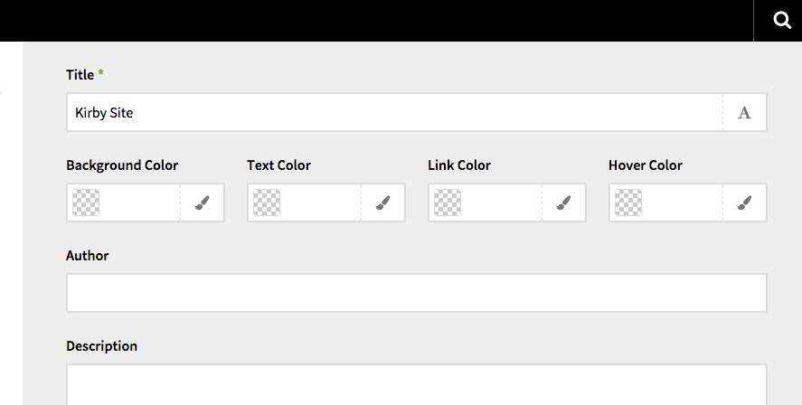

# Color Picker Field for Kirby CMS

A simple color picker field for [Kirby CMS](http://getkirby.com/) which makes use of the [jQuery MiniColors](https://github.com/claviska/jquery-miniColors/) plugin.



## Installation

Copy or link the `color` directory to `site/plugins/` **or** use the [Kirby CLI](https://github.com/getkirby/cli):

```
kirby plugin:install schnti/kirby-color
```

## How to use it

Then in your blueprint you can use the new `color` field.

```
fields:
  bgcolor:
    label: Background Color
    type:  color
    default: 095af0
```

## Credits
Thanks to [@ian-cox](https://github.com/ian-cox) for the initial kirby plugin and [@claviska](https://github.com/claviska) for his great MiniColors plugin.
[@ptouch718](https://github.com/ptouch718) for his masterful JS debugging.
@dionysiusmarquis and @bastianallgeier for helping port it to kirby 2.2

